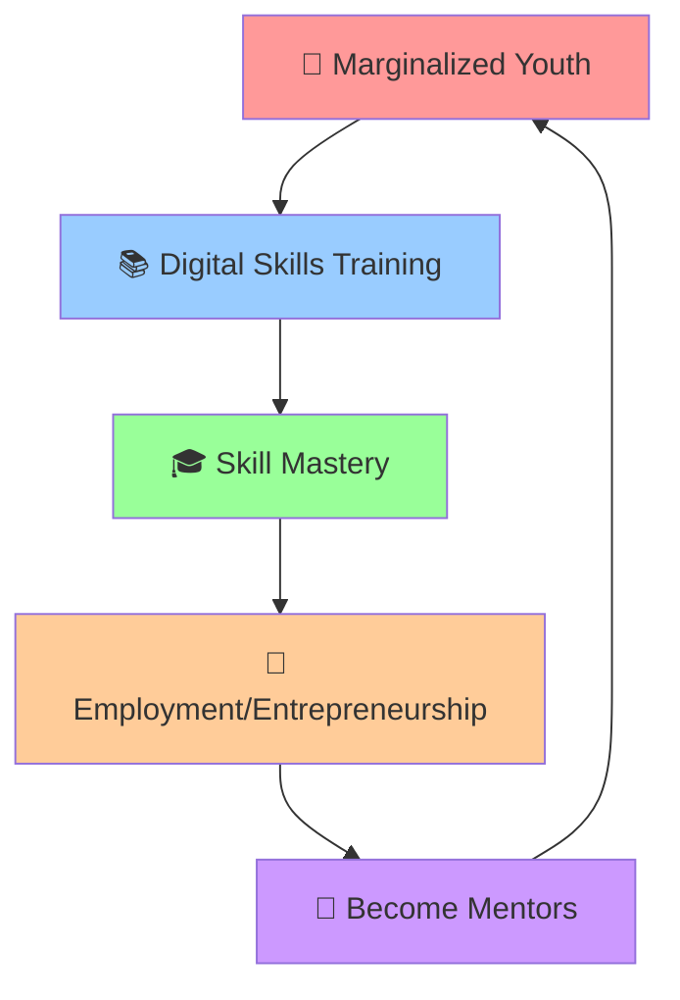
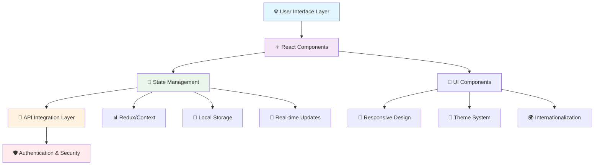

# 🌟 Digital Empowerment Hub – Student Dashboard (Frontend)

<div align="center">
  
  
  
  
  
</div>

<div align="center">
  <h3>A modern React + TypeScript frontend application designed to empower marginalized youth through interactive learning dashboards, community-based education, and mentorship-driven engagement.</h3>
</div>

---

## 📋 Table of Contents

- [🎯 About](#-about)
- [🚀 Vision](#-vision)
- [🎯 Key Objectives](#-key-objectives)
- [✨ Features](#-features)
- [🏗️ System Architecture](#️-system-architecture)
- [📸 Screenshots](#-screenshots)
- [🚀 Getting Started](#-getting-started)
- [📜 Available Scripts](#-available-scripts)
- [💻 Usage](#-usage)
- [🛠️ Technologies Used](#️-technologies-used)
- [🤝 Contributing](#-contributing)
- [📄 License](#-license)
- [📞 Contact](#-contact)

---

## 🎯 About

The Digital Empowerment Hub – Student Dashboard is a comprehensive frontend application that delivers a seamless learning experience for students, instructors, and administrators across multiple countries including Malaysia, Vietnam, and beyond.

**What we provide:**

- 🎓 **Personalized dashboards** for tracking learning progress
- 📚 **Interactive courses** with multimedia content
- 💬 **Community forums** for peer-to-peer learning
- 🤝 **Mentorship connections** with industry professionals
- 🏆 **Certificate management** and achievement tracking
- 🌍 **Multi-language support** for global accessibility
- 🌙 **Dark/Light theme** for enhanced user experience

---

## 🚀 Vision

We aim to build **sustainable learning hubs** with a self-sustaining mentorship cycle that creates lasting impact:



**The Cycle:**

1. **Students** learn essential digital skills
2. **Graduates** secure employment or start businesses
3. **Alumni** return as mentors
4. **Knowledge** is recycled back into the community
5. **Impact** multiplies exponentially

---

## 🎯 Key Objectives

| Objective                 | Description                               | Target Impact                  |
| ------------------------- | ----------------------------------------- | ------------------------------ |
| 💻 **Skill Development**  | Digital literacy & technical training     | 10,000+ youth skilled by 2027  |
| 🏘️ **Community Building** | Peer-to-peer support networks             | 50+ learning communities       |
| 🧑‍🏫 **Mentorship**         | Alumni and industry professional guidance | 1:5 mentor-to-student ratio    |
| 🔄 **Sustainability**     | Self-sustaining ecosystem                 | 80% graduate mentorship return |
| 🚪 **Opportunity Access** | Pathways to jobs & entrepreneurship       | 70% employment rate            |

---

## ✨ Features

### 🎓 Student Interface

- **📊 Interactive Dashboard**: Real-time progress tracking with visual analytics
- **📚 Course Management**: Browse, enroll, and complete courses seamlessly
- **📈 Progress Analytics**: Detailed learning journey visualization
- **💬 Community Forum**: Peer learning discussions and support
- **🤝 Mentorship Matching**: AI-powered mentor-student connections
- **🏆 Certificate Viewer**: Digital badge and certificate management
- **🌐 Multi-language Support**: Turkish, English, Malay, Vietnamese
- **📱 Responsive Design**: Mobile-first approach for all devices

### 👨‍🏫 Instructor Interface

- **🎨 Course Builder**: Drag-and-drop course creation tools
- **📊 Student Progress**: Visual learner performance tracking
- **📝 Assessment Tools**: Quiz and assignment creation platform
- **💬 Communication Hub**: Direct messaging with students
- **📈 Analytics Dashboard**: Detailed teaching insights

### 🏢 Admin Interface

- **👥 User Management**: Comprehensive user role management
- **📊 System Analytics**: Platform usage and performance metrics
- **💰 Payment Integration**: Donation and fee management
- **🔧 Content Management**: Global content and settings control
- **📧 Communication Tools**: Mass messaging and announcements

---

## 🏗️ System Architecture

### Frontend Architecture



### Technology Stack

| Layer                  | Technology         | Purpose                            |
| ---------------------- | ------------------ | ---------------------------------- |
| **Frontend Framework** | React 18.3.1       | Component-based UI development     |
| **Language**           | TypeScript 5.2.2   | Type-safe JavaScript development   |
| **Build Tool**         | Vite 5.0.0         | Fast development and build process |
| **Styling**            | Tailwind CSS 3.4.0 | Utility-first CSS framework        |
| **UI Components**      | Radix UI           | Accessible component primitives    |
| **Icons**              | Lucide React       | Beautiful, customizable icons      |
| **Charts**             | Recharts 2.8.0     | Data visualization components      |
| **Forms**              | React Hook Form    | Performant form handling           |
| **Validation**         | Zod                | Schema validation                  |

### File Structure

```
📁 Frontend/
├── 📄 README.md                    # This file
├── 📄 INSTALLATION.md             # Detailed setup guide
├── 📄 package.json                # Dependencies & scripts
├── 📄 tsconfig.json               # TypeScript configuration
├── 📄 tailwind.config.ts          # Tailwind CSS configuration
├── 📄 vite.config.ts              # Vite build configuration
├── 📄 index.html                  # HTML entry point
├── 📄 main.tsx                    # Application entry point
├── 📄 App.tsx                     # Main App component
│
├── 📁 components/                 # React components
│   ├── 📄 About.tsx               # About section
│   ├── 📄 Contact.tsx             # Contact form
│   ├── 📄 Footer.tsx              # Site footer
│   ├── 📄 Header.tsx              # Navigation header
│   ├── 📄 Hero.tsx                # Landing page hero
│   ├── 📄 Impact.tsx              # Impact metrics
│   ├── 📄 Innovation.tsx          # Innovation timeline
│   ├── 📄 LanguageToggle.tsx      # Language switcher
│   ├── 📄 PaymentIntegration.tsx  # Donation system
│   ├── 📄 Reviews.tsx             # User testimonials
│   ├── 📄 Roadmap.tsx             # Project roadmap
│   ├── 📄 SEOHead.tsx             # SEO meta tags
│   ├── 📄 Solutions.tsx           # Solutions showcase
│   ├── 📄 ThemeProvider.tsx       # Theme management
│   │
│   ├── 📁 figma/                  # Figma components
│   │   └── 📄 ImageWithFallback.tsx
│   │
│   └── 📁 ui/                     # Reusable UI components
│       ├── 📄 button.tsx          # Button component
│       ├── 📄 card.tsx            # Card component
│       ├── 📄 input.tsx           # Input component
│       └── ... (45+ UI components)
│
├── 📁 lib/                        # Utility libraries
│   ├── 📄 content.ts              # Content management
│   └── 📄 useTheme.ts             # Theme hook
│
├── 📁 styles/                     # Styling files
│   └── 📄 globals.css             # Global CSS with Tailwind
│
└── 📁 guidelines/                 # Project guidelines
    └── 📄 Guidelines.md           # Development standards
```

---

## 📸 Screenshots

### 🏠 Homepage

<div align="center">
  
  
  <p><em>Homepage in Light Mode (left) and Dark Mode (right)</em></p>
</div>

### 📊 Student Dashboard

<div align="center">
  
  <p><em>Interactive student dashboard with progress tracking</em></p>
</div>

### 📚 Course Interface

<div align="center">
  
  <p><em>Course management and learning interface</em></p>
</div>

### 📱 Mobile Responsive

<div align="center">
  
  <p><em>Fully responsive design for mobile devices</em></p>
</div>

> **Note**: Screenshots will be updated as the application development progresses. For the latest UI updates, please check the live demo.

---

## 🚀 Getting Started

### Prerequisites

Before you begin, ensure you have the following installed:

- **Node.js**: Version 18.0.0 or higher ([Download here](https://nodejs.org/))
- **npm**: Version 9.0.0 or higher (comes with Node.js)
- **Git**: For version control ([Download here](https://git-scm.com/))

### Quick Start

1. **Clone the repository**

   ```bash
   git clone https://github.com/mawlid1431/DEH_Frontend.git
   cd DEH_Frontend
   ```

2. **Install dependencies**

   ```bash
   npm install
   ```

3. **Start development server**

   ```bash
   npm run dev
   ```

4. **Open your browser**
   Navigate to [http://localhost:3000](http://localhost:3000)

### Detailed Installation

For comprehensive installation instructions including system requirements, environment setup, and troubleshooting, please refer to our detailed [INSTALLATION.md](./INSTALLATION.md) guide.

---

## 📜 Available Scripts

In the project directory, you can run:

| Command              | Description                                                 |
| -------------------- | ----------------------------------------------------------- |
| `npm run dev`        | 🚀 Starts the development server at `http://localhost:3000` |
| `npm run build`      | 🏗️ Builds the app for production to the `dist` folder       |
| `npm run preview`    | 👀 Preview the production build locally                     |
| `npm run lint`       | 🔍 Runs ESLint to check code quality                        |
| `npm run lint:fix`   | 🔧 Automatically fixes linting issues                       |
| `npm run type-check` | ✅ Runs TypeScript type checking                            |

### Development Workflow

```bash
# Start development
npm run dev

# Check for issues
npm run lint
npm run type-check

# Build for production
npm run build
npm run preview
```

---

## 💻 Usage

### Environment Configuration

Create a `.env.local` file in the root directory:

```env
# Application Settings
NEXT_PUBLIC_APP_NAME="Digital Empowerment Hub"
NEXT_PUBLIC_APP_URL="http://localhost:3000"

# API Configuration
NEXT_PUBLIC_API_URL="https://api.digitalempowermenthub.org"

# Analytics
NEXT_PUBLIC_GOOGLE_ANALYTICS_ID="GA_MEASUREMENT_ID"

# Payment Integration
NEXT_PUBLIC_STRIPE_PUBLISHABLE_KEY="pk_test_..."

# Multi-language Support
NEXT_PUBLIC_DEFAULT_LOCALE="en"
NEXT_PUBLIC_SUPPORTED_LOCALES="en,tr,ms,vi"
```

### Customization

The application is highly customizable:

1. **Themes**: Modify `tailwind.config.ts` for custom colors and styling
2. **Content**: Update content in `lib/content.ts`
3. **Components**: All components are modular and reusable
4. **Languages**: Add new language files in the localization system

---

## 🛠️ Technologies Used

### Core Technologies

-  **React 18.3.1** - UI Framework
-  **TypeScript 5.2.2** - Type Safety
-  **Vite 5.0.0** - Build Tool

### Styling & UI

-  **Tailwind CSS 3.4.0** - Styling Framework
-  **Radix UI** - Component Primitives
- **Lucide React** - Icon System

### Data & Forms

- **React Hook Form 7.47.0** - Form Management
- **Zod 3.22.4** - Schema Validation
- **Recharts 2.8.0** - Data Visualization

### Development Tools

- **ESLint** - Code Linting
- **Prettier** - Code Formatting
- **Autoprefixer** - CSS Vendor Prefixes

---

## 🤝 Contributing

We welcome contributions from the community! Here's how you can help:

### How to Contribute

1. **Fork the repository**
2. **Create a feature branch**
   ```bash
   git checkout -b feature/amazing-feature
   ```
3. **Make your changes**
4. **Run tests and linting**
   ```bash
   npm run lint
   npm run type-check
   ```
5. **Commit your changes**
   ```bash
   git commit -m "feat: add amazing feature"
   ```
6. **Push to the branch**
   ```bash
   git push origin feature/amazing-feature
   ```
7. **Open a Pull Request**

### Contribution Guidelines

- Follow the existing code style and conventions
- Write clear, descriptive commit messages
- Add tests for new features
- Update documentation as needed
- Ensure all existing tests pass

### Code of Conduct

This project adheres to a Code of Conduct. By participating, you are expected to uphold this code. Please report unacceptable behavior to [malitmohamud@gmail.com](mailto:malitmohamud@gmail.com).

---

## 📄 License

This project is licensed under the **MIT License** - see the [LICENSE](LICENSE) file for details.

```
MIT License

Copyright (c) 2025 Digital Empowerment Hub

Permission is hereby granted, free of charge, to any person obtaining a copy
of this software and associated documentation files (the "Software"), to deal
in the Software without restriction, including without limitation the rights
to use, copy, modify, merge, publish, distribute, sublicense, and/or sell
copies of the Software, and to permit persons to whom the Software is
furnished to do so, subject to the following conditions:

The above copyright notice and this permission notice shall be included in all
copies or substantial portions of the Software.

THE SOFTWARE IS PROVIDED "AS IS", WITHOUT WARRANTY OF ANY KIND, EXPRESS OR
IMPLIED, INCLUDING BUT NOT LIMITED TO THE WARRANTIES OF MERCHANTABILITY,
FITNESS FOR A PARTICULAR PURPOSE AND NONINFRINGEMENT. IN NO EVENT SHALL THE
AUTHORS OR COPYRIGHT HOLDERS BE LIABLE FOR ANY CLAIM, DAMAGES OR OTHER
LIABILITY, WHETHER IN AN ACTION OF CONTRACT, TORT OR OTHERWISE, ARISING FROM,
OUT OF OR IN CONNECTION WITH THE SOFTWARE OR THE USE OR OTHER DEALINGS IN THE
SOFTWARE.
```

---

## 📞 Contact

### Project Creator

**Mowlid Haibe**  
_Digital Empowerment Hub Founder & Lead Developer_

- 📧 Email: [malitmohamud@gmail.com](mailto:malitmohamud@gmail.com)
- 🌐 LinkedIn: [Connect with me](https://www.linkedin.com/in/mowlid-mohamoud-haibe-8b7b6a189/)
- 🐙 GitHub: [@mowlid-haibe](https://github.com/mawlid1431)

### Project Information

- **Project Start Date**: September 23, 2025
- **Current Version**: 1.0.0
- **Status**: Active Development
- **Project Repository**: [Digital Empowerment Hub](https://github.com/yourusername/digital-empowerment-hub)

---

### Project Information

- **📅 Project Start Date**: September 23, 2025
- **📋 Current Version**: 1.0.0
- **🚀 Status**: Active Development
- **📂 Repository**: [DEH_Frontend](https://github.com/mawlid1431/DEH_Frontend)
- **🔗 Live Demo**: [Coming Soon](https://deh-frontend.vercel.app)

---

<div align="center">
  <h3>🌟 Star this repository if you found it helpful! 🌟</h3>
  <p>Made with ❤️ for empowering marginalized youth worldwide</p>
  
  
  
  
</div>

---

_This project is part of the Digital Empowerment Hub initiative to create sustainable, community-driven educational ecosystems for marginalized youth across Malaysia, Vietnam, and beyond._
